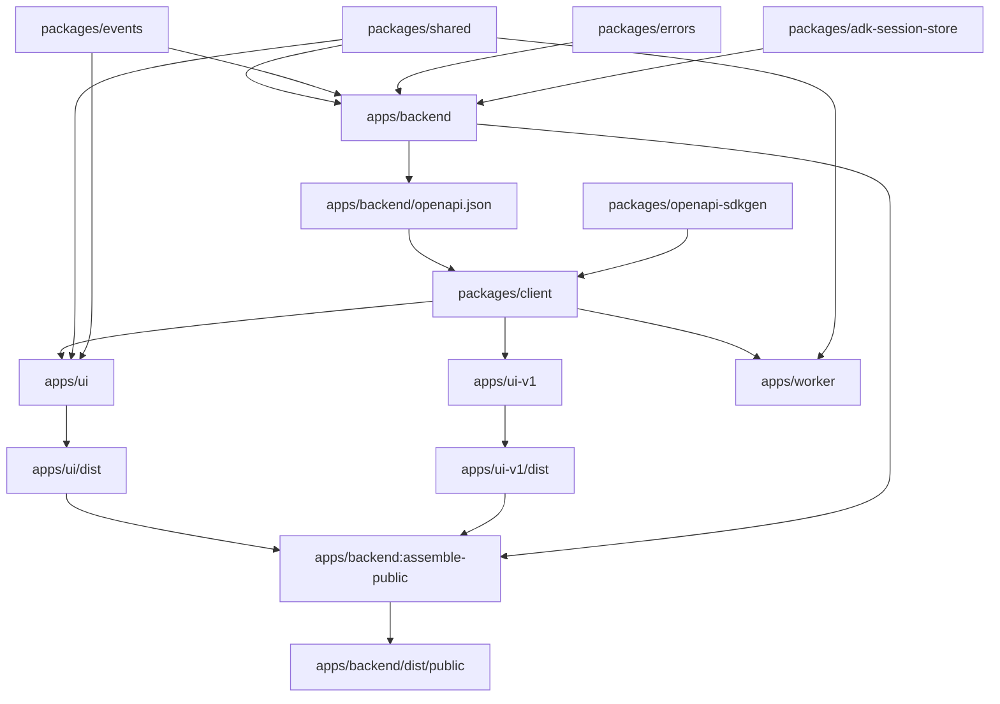

# Dependency Graph

This file describes the current Taico dependency graph for the main product:

- `apps/backend`
- `apps/ui`
- `apps/worker`
- `packages/client`
- `packages/shared`
- `packages/events`
- `packages/errors`
- `packages/adk-session-store`
- `packages/openapi-sdkgen`

It does not try to document every workspace in the monorepo.

# Package Dependencies

`apps/backend` depends on:
- `packages/shared`
- `packages/events`
- `packages/errors`
- `packages/adk-session-store`

`apps/ui` depends on:
- `packages/client`
- `packages/shared`
- `packages/events`

`apps/worker` depends on:
- `packages/client`
- `packages/shared`

`packages/client` depends on:
- `apps/backend` for the OpenAPI spec
- `packages/openapi-sdkgen` for generating the v2 client

# Build Dependencies

Builds are orchestrated by [nx](https://nx.dev). The dependency graph below is what nx walks; you don't run these steps manually.

`npm run build:prod` is `nx run-many -t assemble-public,build:prod -p @taico/taico,@taico/worker`. nx pulls every transitive dep and runs them in the correct order, in parallel where possible, with content-hash caching.

Order nx executes:

1. Build leaf packages in parallel:
- `packages/shared`, `packages/events`, `packages/errors`, `packages/adk-session-store`, `packages/openapi-sdkgen`

2. Build `apps/backend` (`build:prod`)
- Compiles via `nest build`
- Generates `apps/backend/openapi.json`

3. Build `packages/client` (`build:prod`)
- Has an `implicitDependency` on `@taico/taico` and `@taico/openapi-sdkgen` (declared in `packages/client/project.json`)
- Declares `apps/backend/openapi.json` as an input so its cache busts when the spec changes
- Copies `apps/backend/openapi.json`, generates TypeScript types, generates v1 and v2 clients

4. Build `apps/ui` and `apps/ui-v1` in parallel (`build:prod`)
- Each writes only to its own `dist/`

5. Run `apps/backend:assemble-public` (declared in `apps/backend/project.json`)
- `dependsOn` `@taico/ui:build:prod` and `@taico/ui-v1:build:prod`
- Copies `apps/ui/dist` → `apps/backend/dist/public`
- Copies `apps/ui-v1/dist` → `apps/backend/dist/public/beta`
- This is the only owner of `apps/backend/dist/public/`

6. Build `apps/worker` (`build:prod`)

For details on how nx is wired (project.json conventions, cache behavior, adding a new package, troubleshooting), see [Build System](how-to-guides/build-system.md).

# Runtime Dependencies

Production server:
- `apps/backend` serves the API
- `apps/backend` also serves the built `apps/ui` files as static content

Frontend runtime:
- `apps/ui` talks to `apps/backend`
- `apps/ui` uses `packages/client` for API calls
- `apps/ui` uses `packages/events` for shared event types

Worker runtime:
- `apps/worker` talks to a running Taico server
- `apps/worker` uses `packages/client` to call the server API

# Short Graph

```text
packages/shared ------------> apps/backend
packages/events ------------> apps/backend
packages/errors ------------> apps/backend
packages/adk-session-store -> apps/backend

apps/backend ---------------> packages/client
packages/openapi-sdkgen ---> packages/client

packages/client -----------> apps/ui
packages/shared -----------> apps/ui
packages/events -----------> apps/ui

packages/client -----------> apps/worker
packages/shared -----------> apps/worker

apps/ui/dist + apps/ui-v1/dist -> apps/backend:assemble-public -> apps/backend/dist/public
```

# Mermaid Graph


