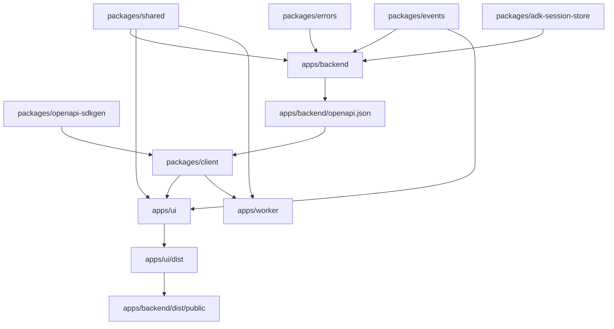

# Dependency Graph

This file describes the current Taico dependency graph for the main product:

- `apps/backend`
- `apps/ui`
- `apps/worker`
- `packages/client`
- `packages/shared`
- `packages/events`
- `packages/errors`
- `packages/adk-session-store`
- `packages/openapi-sdkgen`

It does not try to document every workspace in the monorepo.

# Package Dependencies

`apps/backend` depends on:
- `packages/shared`
- `packages/events`
- `packages/errors`
- `packages/adk-session-store`

`apps/ui` depends on:
- `packages/client`
- `packages/shared`
- `packages/events`

`apps/worker` depends on:
- `packages/client`
- `packages/shared`

`packages/client` depends on:
- `apps/backend` for the OpenAPI spec
- `packages/openapi-sdkgen` for generating the v2 client

# Build Dependencies

Production build order:

1. Build shared packages:
- `packages/shared`
- `packages/events`
- `packages/errors`
- `packages/adk-session-store`
- `packages/openapi-sdkgen`

2. Build `apps/backend`
- This also generates `apps/backend/openapi.json`

3. Build `packages/client`
- Copies `apps/backend/openapi.json`
- Generates TypeScript types
- Generates the v1 and v2 clients

4. Build `apps/ui`

5. Copy `apps/ui/dist` into `apps/backend/dist/public`
- This makes the frontend part of the backend production artifact

6. Build `apps/worker`

# Runtime Dependencies

Production server:
- `apps/backend` serves the API
- `apps/backend` also serves the built `apps/ui` files as static content

Frontend runtime:
- `apps/ui` talks to `apps/backend`
- `apps/ui` uses `packages/client` for API calls
- `apps/ui` uses `packages/events` for shared event types

Worker runtime:
- `apps/worker` talks to a running Taico server
- `apps/worker` uses `packages/client` to call the server API

# Short Graph

```text
packages/shared ------------> apps/backend
packages/events ------------> apps/backend
packages/errors ------------> apps/backend
packages/adk-session-store -> apps/backend

apps/backend ---------------> packages/client
packages/openapi-sdkgen ---> packages/client

packages/client -----------> apps/ui
packages/shared -----------> apps/ui
packages/events -----------> apps/ui

packages/client -----------> apps/worker
packages/shared -----------> apps/worker

apps/ui/dist -------------> apps/backend/dist/public
```

# Mermaid Graph


